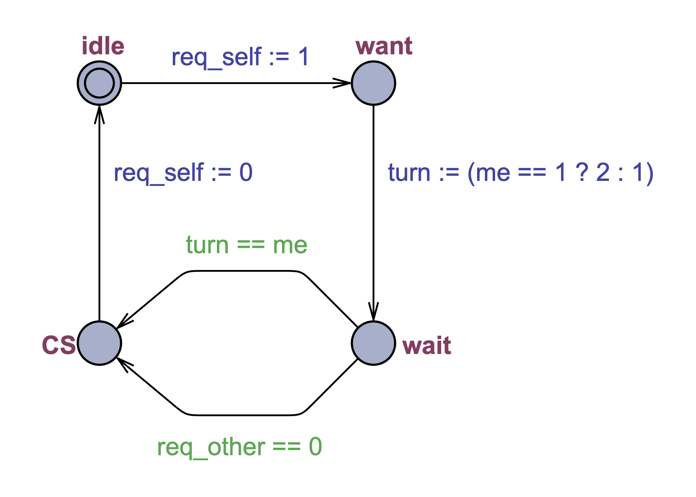

## Mutex in UPPAAL
Derive an automaton based on Peterson's mutual exclusion algorithm and check its properties using verification tools.

The algorithm for two concurrent processes in C.  
**Process 1**
```c
req1 = 1;
turn = 2;
while(turn != 1 && req2 != 0){
    // busy wait
}   
// critical section - start
job1();       
// critical section - end
req1 = 0
```

**Process 2**
```c
req2 = 1;
turn = 1;
while(turn != 2 && req1 != 0){
// busy wait
}
// critical section - start
job2();
// critical section - end
req2 = 0;
```
### Create the mutex template
- Blue expressions are assignment to variables, that are executed when the transition is taken. To create assignment, edit the '**Update**' section of the created edge.
- Green expressions are guards that have to be true in order for the corresponding transition to be enabled. To create guard, edit the '**Guard**' section of the created edge.
- To specify the name of the template, edit the '**Name**' field just above the drawing area.
- To specify parameters, write them in the '**Parameters**' field just above the drawing area. For this specific example it will be: 
- `const int[1,2] me, int[0,1] &req_self, int[0,1] &req_other`


### Create the system
Place the following code snippet into the **System declarations** section of the project. This will create two instances of mutex template and compose them into a system.
```C
// Place template instantiations here. 
P1 = mutex(1, req1, req2); 
P2 = mutex(2, req2, req1); 
// List one or more processes to be composed into a system. 
system P1, P2;
```

Place the following code snippet into the **Declarations** section of the project. Variables used by the system will be declared on the global level.
```C
int[0,1] req1,req2; 
int[1,2] turn;
```

Perform the syntax check and fix issues if any. 
**Tools** $\rightarrow$ **Check Syntax (cmd + E)**

### Simple verification
Click on the **Verifier** tab, click on the Insert button, click in the **Query** text area and write the mutual exclusion property: `A[] not (P1.CS and P2.CS)`. Press the **Check** button and you are done. There should be a green button lighted on, which means that the property was verified. 
- `A[] not (P1.CS and P2.CS)` - For all combinations, there is not a single one where process **P1** and **P2** are both in the critical section of the system.
- `E<> P1.CS` - There exist a combination where process **P1** reaches the critical section of the system.

If a property fails in the verifier, choose **Options** $\rightarrow$ **Diagnostic Trace** and go back to the **Symbolic Simulator**. In the **Simulation Trace** section you will be able to replay scenario that broke the property defined in the **Verifier**.
