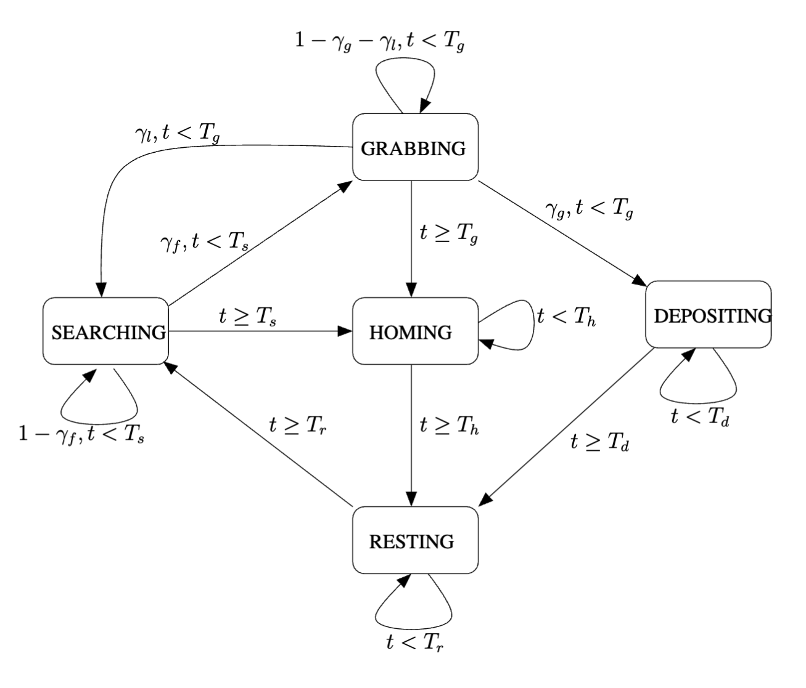

## Paper - Formal Verification of Probabilistic Swarm Behaviours
Note on: [Formal Verification of Probabilistic Swarm Behaviours](../Relevant%20Papers/Formal%20Verification%20of%20Probabilistic%20Swarm%20Behaviours.pdf)  
Year: **2010**  
Model checker: **PRISM**  

"Whilst the behaviour of each individual robot is fairly easy to understand, it is considerably harder to predict and guarantee the emergent behaviours of the overall swarm. Consequently, it is very difficult to design an individual robot control procedure that, when replicated across all the robots, will guarantee the required swarm behaviour."

### Foraging robot
- **Searching** - robot is searching for food items
- **Grabbing** - robot attempts to grab a food item it has found 
- **Depositing** - robot moves home with the food item
- **Homing** - robot moves home without having found food
- **Resting** - robot rests for a particular time interval

### Associated states and time-out conditions
$T_s$ - the maximum amount of time a robot can continue searching
$T_g$ - the maximum amount of time a robot can attempt grabbing
$T_d$ - $(T_h / T_r)$ the average time spent depositing (homing/resting)
$\gamma_f$ - the probability of finding a food item
$\gamma_g$ - the probability of grabbing a food item
$\gamma_l$ - the probability of losing sight of a food item, e.g due to robot interference

### Probabilistic finite state machine for a single foraging robot

- All robots are initially in the state **SEARCHING** 
- In each time step, robots move to the **GRABBING** state with probability $\gamma_f$ (the chance of a robot finding food). 
- Robots stay in the **SEARCHING** state with probability $1-\gamma_f$ 
- If a robot cannot find food within $T_s$ time steps, it will move to the **HOMING** state. 
- In the **GRABBING** state the robots:
	- move to the **DEPOSITING** state with probability $\gamma_g$ (the chance of grabbing the food), 
	- move to the **SEARCHING** state with probability $\gamma_l$ (the chance of losing sight of food as it has been grabbed by another robot),
	- stay in the **GRABBING** state with probability $(1 − \gamma_g ) − \gamma_l$ 
	- If a robot cannot grab a food item in $T_g$ time steps, it will move to the **HOMING** state.
- The robots in the **HOMING** (respectively **DEPOSITING** , **RESTING** ) state take $T_h$ (respectively $T_d$ , $T_r$ ) time steps to return back to the nest (respectively deposit food, rest) before they move to the next state.

### Counting abstraction approach
If we wanted to build a state-machine from individual state-machines for all individual robots, the resulting model would be huge. Instead we used a counting abstraction approach.

Since all robots are modelled by identical probabilistic state machines, we will model the state machine using the same states: **SEARCHING**, **HOMING**, etc. To each of this states we add a counter which will be used to record number of robots in that state at the moment.

### Property: Probability of finding food influence on energy conservation
Determining the probability of: "for an arbitrary number of robots and food finding probability the swarm energy is equal to or greater than the initial energy from a time point $t_A$".
- This implies that from a time point $t_A$ the total energy of the swarm never goes below the initial energy.
- We assume:
	- $\gamma_f$ takes discrete steps with increments of $0.01$ in the range $[0, .., 1]$
	- $N = [100, .., 500]$
	- $t_A = 2000$
	- $t_{max} = 10000$
- Property in PCTL: `P =? ((t < t A ∨ En ≥ E(0)) U t=t_max )`
- Result = 0.59

### Property: Swarm energy levels before timeout
Determining the probability of: "the total energy never reduces below a certain value $E$ (before timeout)"
We assume:
- $E = 1900 \cdot 10^3$
- $N = [100, ..., 500]$
- Property in PCTL: 
- `P =? (true U (En > E ∧ P=1♦(En > E ∧ t=tmax)))`
- Result = 0.31

### Conclusions
"In this paper we have taken a probabilistic state transition system for foraging swarm robots from and used it as the basis for verification of global swarm behaviour using the PRISM model-checker. Rather than instantiating such a transition system for each robot and performing local verification, we adopt a macroscopic approach and represent the whole swarm using one transition system calculating the number of robots in each state based on a combination of the number of robots in the previous state and the probability that robots change state. This allows us to simulate the global foraging robot scenario for a number of parameters. In particular we investigate the changes to swarm energy relating to changing the probability of finding food and differing resting timeouts"