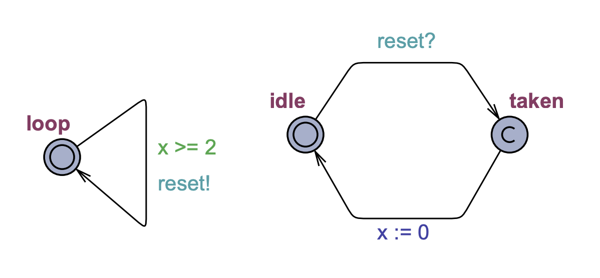

## Time in UPPAAL
Time is used through *clocks*. In the example, `x` is a clock declared as `clock x;` in the global **Declarations** section. A channel `reset` is used for synchronisation with the observer, which is also declared (as `chan reset`) in the **Declarations** section. The channel synchronisation is a hand-shaking between `reset!` and `reset?` in our example. So in this example the clock may be reset after 2 time units. The observer detects this and actually performs the reset. Left model is the automaton and the right is an observer.

### Properties
- `A[] Obs.taken imply x>=2` - For all states, being in the location `Obs.taken` implies that `x >= 2`.
- `E<> Obs.idle and x > 30` - Is it possible to reach a state where `Obs` is in the location idle and `x > 30`. ( automaton can stay in the loop state infinitely long )

### Invariant in the automaton
The invariant is a *progress condition*: the system is not allowed to stay in the state more than 3 time units (more precisely: only as long as the clock `x` is no larger than 3), so the transition has to be taken and the clock reset in our example. To add an invariant, double click on the **loop** state of the automaton and place the condition in the **Invariant** section.

To see the difference, try the properties: 
- `A[] Obs.taken imply (x >= 2 and x <= 3)` : to show that the transition is taken when `x` is in the interval `[2, 3]`. 
- `E<> Obs.idle and x > 2` : it is possible to take the transition with `x` in the interval `(2, 3]`. 
- `A[] Obs.idle imply x <= 3` : to show that the upper bound is respected. 
- The former property `E<> Obs.idle and x > 3` no longer holds.

