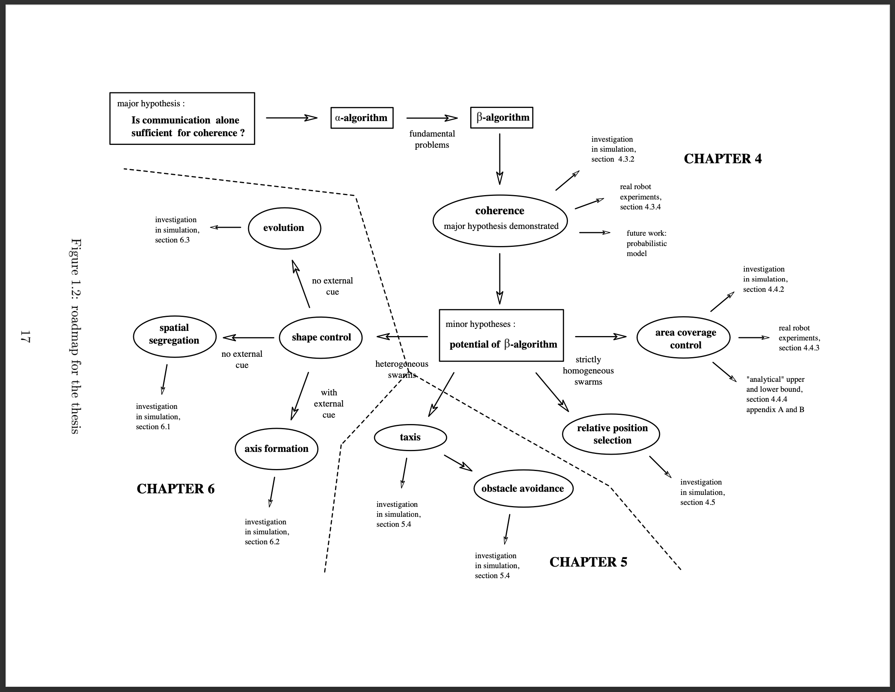

[Minimalist Coherent Swarming of Wireless Networked Autonomous Mobile Robots](../Papers/Minimalist%20Coherent%20Swarming%20of%20Wireless%20Networked%20Autonomous%20Mobile%20Robots.pdf)

Paper roadmap:

### Major Hypothesis
That it is possible, given the constraint of limited-range wireless communication, to achieve a stable connected swarm in an unbounded environment. We shall call this property *coherence*.

### Contribution
2. An algorithm (the $\beta$-algorithm) is developed that is able using second order information (neighbour's' list of neighbours) to guarantee the coherence of the swarm (see the $\beta$-algorithm section **4.12**). This algorithm has the capacity to tune through a single parameter the connectivity of the swarm (see section **4.3**). This connectivity measure represents the resilience of the dynamical network to loss of connections and failure of the nodes. This means that the algorithm is able to tune the robustness of the connected network (see section **3.5.1**). Furthermore the same parameter has the power to control the area covered by the swarm (see section **4.4**). It is also shown that the behaviour presented show good scalability with increasing swarm size and good resilience to increasing noise (see section **4.3.2**).
4. The $\beta$-algorithm is implemented on real robots and the capacity of the algorithm to achieve coherence is confirmed, despite strong compromises on the requirements assumed by the simulation experiments. Also a thorough investigation of the possible reasons for differences noted in robot performance is conducted.
5. It is shown by the localisation-$\beta$-algorithm that the exchange of information required by the $\beta$-algorithm is sufficient for a robot to approximate its global relative position (see section **4.5**).

### Methods
**In the young field of robotics the way to assert a scientific discovery is not yet commonly agreed.** The difficulty of mathematically formalising the notion of emergence and the cost of real robot experiments in terms of time and money has led researchers in the field to state experimental guidelines that remain far from a solid scientific proof [Bisset, 2003].

It is now widely agreed that real robot experiments are needed to confirm results from simulations, however accurate they may be, because of the obvious impossibility of representing all of the interactions that can have an influence on the problem considered. The idea coming from the the new roboticists such as Brooks [Brooks, 1991] is that the **complexity of the real world is best represented by itself.**

### Robot Architecture
- The robots that will be used in the real robot experiments are the Linuxbots developed in the IAS lab in Bristol.
- In the simulation, it is assumed the robots are able to move forward and turn on-the-spot with a precision ranging from perfect to errors of 10% on the distance or angle travelled, that they have infra-red avoidance sensors, are equipped with a limited-range radio device and they carry an omni-directional light sensor able to detect whether a robot is illuminated or not.
- **The robots' control system is designed as a finite state automaton.** A robot will be in one of several mutually exclusive states and switch between them according to environmental cues.

### Coherence
In the real world, unbounded environment seem as ubiquitous as bounded ones. If it is sometimes possible to restrict the environment or assume it is bounded, this is certainly not true in general. Consider only fluid environments such as the atmosphere or the oceans. In trying to keep a group of robots together in such an environment there are two approaches: **either give the robots an ability to come back towards the group or design a swarming algorithm that will not allow any robot to lose the group.** [...] Following the desire for minimalism presented in chapter 2, the second approach will therefore be pursued: throughout this chapter the aim is to show the capacity of the algorithm developed to achieve stable swarming of the robots. It will be referred to as *coherence*. 
