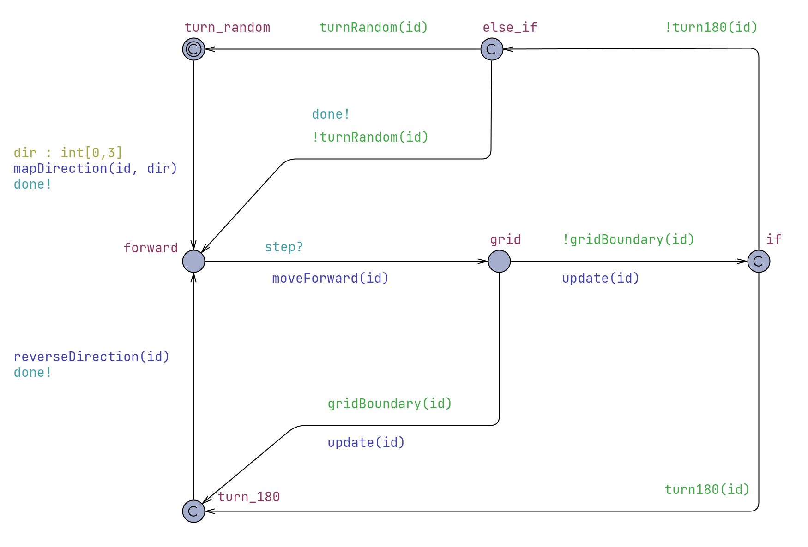

```
Create list of neighbours for robot, Nlist
k = number of neighbours in Nlist
i = 0

loop forever {
	i = i modulo cadence

	if (i = 0) {
		Send ID message

		Save copy of k in LastK
		Set reaction indicator Back to FALSE
		k = number of neighbours in Nlist
		Create LostList comparing Nlist and OldList

		for (each robot in LostList) {
			Find nShared, number of shared neighbours
			if (nShared <= beta) {
				Set reaction indicator Back to TRUE
			}
		}

		if (Back = TRUE) {
			turn robot through 180 degrees
		}
		else if (k > LastK) {
			make random turn
		}
		
		Save copy of Nlist in Oldlist
	}
	Steer the robot according to state
	Listen for calls from robots in range
	Grow Nlist with neighbours IDs and connection info

	i++
}

```


### Next time
Inspect `turn180(id)`, there is something wrong with counting shared neighbours.

Check that all the states are reachable. Check that they are not only reachable as the next states after initial state.

I wrongly interpreted this part of the pseudocode:
```
for (each robot in LostList) {
			Find nShared, number of shared neighbours
			if (nShared <= beta) {
				Set reaction indicator Back to TRUE
			}
		}
```

**Previously:**
`If LostList is empty then nShared=0 and Back=True`

**Now:**
`If LostList is empty we do not execute this part of code as there are no elements to iterate over`
`We do not care about nShared`
`Back=False`

- ~~Add clock and invariant on not committed states.~~
- ~~Verify implementation in a similar way to alpha algorithm.~~
- Model scenarios described in the paper.

### Verification
```
const int N = 2;
const int R = 2;
const int STEP = 1;
const int BETA = 1;
const int G = 3;
const int T_MAX = 1;
clock C;
```

`E<> forall(i : int[0, N-1]) x[i] == G && y[i] == G` - FALSE
There is no path for any robot that leads to the corner of the grid.

`A[] forall(i : int[0, N-1]) abs(x[i]) <= G && abs(y[i]) <= G` - TRUE
For all the paths, all robots stay within grid boundaries

`E<> C > 0 && P0.turn_random` - TRUE
There exists a path for robot P0 to reach location turn_random after initialisation.

`E<> forall(i : int[0, N-1]) C > T_MAX && k[i] == 0 && last_k[i] == 0` - TRUE
Two robots can get disconnected after initialisation for more than two steps each.

`E<> P0.turn_180 && abs(x[0]) != G && abs(y[0]) != G` - TRUE
There exist a path for robot P0 to reach location turn_180 without reaching the boundary of the grid

`E<> P0.turn_180 && (abs(x[0]) == G || abs(y[0]) == G)` - TRUE
There exists a path for robot P0 to reach location turn_180 by reaching the boundary of the grid

`E<> P0.forward && k[0] <= last_k[0]` - TRUE
There exist a path where robot moves forward without changing direction

`A[] not deadlock` - TRUE
There is no path which results in deadlock

`A[] forall(i : int[0, N-1]) C > 0 imply x_dir[i] != 0 or y_dir[i] != 0` - TRUE
All robots have set direction after initialisation


### Properties for the algorithm

1. Three robots after initialisation can be disconnected for at least two steps each.
```
const int N = 3;        // Number of robots
const int R = 2;        // Signal radius
const int STEP = 1;     // Step size
const int BETA = 2;     // Beta parameter
const int G = 3;        // Grid boundary => Grid : 2G x 2G
const int T_MAX = 1;    // Time threshold on invariant
```

```
E<> forall(i : int[0, N-1]) C > T_MAX && k[i] == 0 && last_k[i] == 0
```


"The $\beta$-algorithm also prevents the formation of cutvertices as long as $\beta$ is greater or equal to 2. Indeed in the situation depicted in figure 4.14 a cutvertex is about to be formed. But the presence of a cutvertex implies that there can only be one shared neighbour. Hence a reaction to prevent a cutvertex providing $\beta \geq 2$."


#### 3 robots
```
const int N = 3;        // Number of robots
const int R = 1;        // Signal radius
const int STEP = 1;     // Step size
const int BETA = 2;     // Beta parameter
const int G = 3;        // Grid boundary => Grid : 2G x 2G
const int T_MAX = 1;    // Time threshold on invariant
clock C;                // Global clock 
```

Successfully verified properties for `C > {T_MAX, 2*T_MAX, 3*T_MAX, 4*T_MAX}`

`E<> C > T_MAX and forall(i : int[0, N-1]) k[i] == 0 and last_k[i] == 0`
`E<> C > 2 * T_MAX and forall(i : int[0, N-1]) k[i] == 0 and last_k[i] == 0`
`E<> C > 3 * T_MAX and forall(i : int[0, N-1]) k[i] == 0 and last_k[i] == 0`
`E<> C > 4 * T_MAX and forall(i : int[0, N-1]) k[i] == 0 and last_k[i] == 0`

#### 4 robots
```
const int N = 4;        // Number of robots
const int R = 1;        // Signal radius
const int STEP = 1;     // Step size
const int BETA = 2;     // Beta parameter
const int G = 3;        // Grid boundary => Grid : 2G x 2G
const int T_MAX = 1;    // Time threshold on invariant
clock C;                // Global clock
```

Successfully verified properties for....


### 3 robots synchronous
```
const int N = 3;        // Number of robots
const int R = 1/2/3;    // Signal radius
const int STEP = 1;     // Step size
const int BETA = 2;     // Beta parameter
const int G = 3;        // Grid boundary => Grid : 2G x 2G
```

`E<> forall(i : int[0, N-1]) k[i] == 0 and last_k[i] == 0` - Robots can become fully disconnected for at least two steps.

### Error in the synchronised implementation
After the collective move forward of all four robots, there are inconsistencies in the connection state of the robot.

- First robot is connected to all of three other robots.
- Second robot is connected to all three other robots.
- Third robot is connected only to the fourth robot.
- Fourth robot is connected only to the third robot. 

First of all, the connections should be mutual, so if a robot A is connected to robot B then robot B is also connected to robot A. Which is not the case in this situation.

Second of all, the radius of the signal is equal to 1 which means that first and second robot should only be connected to each other and no other robot as the distance to the third and fourth robot is bigger than radius of their signal. 

The issue is probably the race condition caused by multiple robots calling the same three functions upon transitioning from the **forward** state to the grid state.

Functions causing the race condition:
`moveForward(id)`
`updateNeighbours(id)`
`updateConnections(id)`


Solution:
Functions `updateNeighbours` and `updateConnections` were removed from transition **forward** $\rightarrow$ **grid** and added to two subsequent transitions. In this way they will be called on the system of robots with fixed positions. Order of robots calling them has no influence on the state of connections. Race condition was eliminated.


### Verification on the synchronised version of the implementation
```
// System specification
const int N = 4;        // Number of robots
const int R = 1;        // Signal radius
const int STEP = 1;     // Step size
const int BETA = 2;     // Beta parameter
const int G = 3;        // Grid boundary => Grid : 2G x 2G
broadcast chan step;    // Clock tells robots to transition from forward state
chan done;              // Robots tell clock that it reached forward state
```

Verified as true:
`A[] forall(i : int[0, N-1]) k[i] != 0 or last_k[i] != 0`
