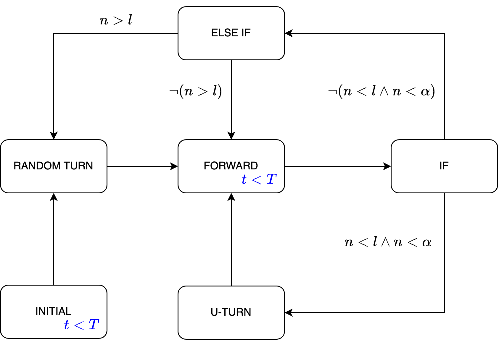

> ~~Connect [Problem statement for research project - corrected](../Formal/Problem%20statement%20for%20research%20project%20-%20corrected.md) with implementation of Alpha algorithm using UPPAAL~~

To test the modelling and testing properties of described swarm behaviours we will implement an alpha algorithm using the verification tool UPPAAL. 
### UPPAAL
**SOURCES:**
[Introduction to UPPAAL](../Notes/Introduction%20to%20UPPAAL.md)
[Time in UPPAAL](../Notes/Time%20in%20UPPAAL.md)
[Expressions in UPPAAL](../Notes/Expressions%20in%20UPPAAL.md)
[Verifying properties in UPPAAL](../Notes/Verifying%20properties%20in%20UPPAAL.md)
[Timed automaton](../Notes/Timed%20automaton.md)

>~~What is it?~~
>~~Why use it?~~
>~~Timed automata~~

"UPPAAL is an integrated tool environment for modeling, simulation and verification of real-time systems. It is appropriate for systems that can be modelled as a collection of non-deterministic processes with finite control structure and real-valued clocks, communicating through channels or shared variables. Typical application areas include real-time controllers and communication protocols in particular, those where timing aspects are critical." ~[UPPAAL in a Nutshell](../Papers/UPPAAL%20in%20a%20Nutshell.pdf)

Swarm of robots fits within description of a system that can be modelled using UPPAAL. It is a collection of non-deterministic processes - single robots, that are defined using finite control structure - algorithm that is transformed into finite state machine. Swarm has to communicate and it can be achieved using channels or shared variables. Finally the emergent behaviour is a result of individual robot behaviour which is influenced by the passing time.

### Alpha algorithm
**SOURCES:**
[Recreating alpha algorithm in UPPAAL pt.1](../Notes/Recreating%20alpha%20algorithm%20in%20UPPAAL%20pt.1.md)
[Recreating alpha algorithm in UPPAAL pt.2](../Notes/Recreating%20alpha%20algorithm%20in%20UPPAAL%20pt.2.md)
[Publications of Alessio Lomuscio](../Notes/Publications%20of%20Alessio%20Lomuscio.md)

> ~~What is it?~~
> ~~Who created it?~~
> ~~Pseudocode~~

Alpha algorithm was introduced by Julien Nembrini in [Minimalist Coherent Swarming of Wireless Networked Autonomous Mobile Robots](../Relevant%20Papers/Minimalist%20Coherent%20Swarming%20of%20Wireless%20Networked%20Autonomous%20Mobile%20Robots.pdf). It was inspired by Kasper Støy's work: [Using Situated Communication in Distributed Autonomous Mobile Robotics](../Relevant%20Papers/Using%20Situated%20Communication%20in%20Distributed%20Autonomous%20Mobile%20Robotics.pdf). Støy proposed and implemented a simple control system for aggregating robots. Instead of relying on environment and localisation information, it uses physical properties of the signal used for communication. Robot behaviour is solely determined by the change in the number of robots that are in the range of its signal.

Alpha algorithm is an approach to an aggregation task within the category of spatial organisation. It is based on assumption that robots send and receive signals through omnidirectional channels like radio or infrared. Single robots make decisions about their movement based only on the number of connections to other robots. The interconnectivity of the swarm is controlled by the alpha parameter which is a threshold on the desired number of connections for a single robot. 

```
Create a list of neighbours for robot, Nlist
k = number of neighours in Nlist
i = 0

loop forever {
	i = i modulo cadence

	if (i = 0){
		Send ID message

		Save copy of k in LastK
		k = number of neighbours in Nlist

		if ((k < lastK) and (k < alpha)){
			turn robot through 180 degrees
		}
		else if (k > LastK) {
			make random turn
		}
	}

	Steer the robot according to state
	Listen for calls from robots in range
	Grow Nlist with neighbours IDs

	i++
}
```
Pseudocode from [Minimalist Coherent Swarming of Wireless Networked Autonomous Mobile Robots](../Relevant%20Papers/Minimalist%20Coherent%20Swarming%20of%20Wireless%20Networked%20Autonomous%20Mobile%20Robots.pdf)

### Movement
>~~Direction~~
>~~Resolution and grid like map~~
>~~Randomness~~

Robot always moves in one of four directions: up, right, down or left. Initial direction is chosen at random and mapped to vertical and horizontal components. Direction will not change unless the robot performs random turn or 180 degree turn. Random turn chooses new direction in the same way that initial direction is determined. This means that random turn may result in maintaining the current direction of the robot with approximately 25% chance. 

Robot movement is achieved by incrementing the robot's coordinates with vertical and horizontal direction components. Direction component values are  $\in \{-1, 0, 1\}$ with one of them being equal to zero and other being different than zero. This means that robot will move in one of four possible directions with a step size equal to one. Every time the robot moves, it will update its coordinates in the globally available data structure. Environment in which robot exists is an unbounded grid that can be continuously traversed in four directions.

Robots are not aware of other robots positions. This means that they can occupy exactly the same point of the grid. Additionally, there is no collision avoidance mechanism that would prevent them from crashing into each other while moving. This simplification could be eliminated but at the cost of implementation being further apart from the original idea of what is an alpha algorithm. We would have to make arbitrary decisions about robot behaviour in the case of collision or inability to move to the occupied point on the grid.

### Connection
~~> Need to mimic technology~~
~~> Distance based connection~~
~~> Alpha parameter~~

Number of robot connections is the main parameter determining the robot behaviour. Therefore it is important to accurately model what it means for robots to be connected. One of the assumptions in Julien Nembrini's [Minimalist Coherent Swarming of Wireless Networked Autonomous Mobile Robots](../Relevant%20Papers/Minimalist%20Coherent%20Swarming%20of%20Wireless%20Networked%20Autonomous%20Mobile%20Robots.pdf) is that physical signal is omnidirectional. However, robot movement is modelled to be two dimensional. Consequently we will assume that two robots are connected if their distance is smaller than radius of physical signal that we mimic. Length of the radius will determine how far apart the robots can move before losing connection.

To mimic the physical signal we need information about robot coordinates, mutual distances, previous and current number of neighbours. This allows for evaluating whether robots are in the signal distance and therefore connected or not. Every time robot moves it will update its own coordinates, previous number of neighbours for itself, current number of neighbours for all robots and mutual distances for all robots. It may seem like the robot is using more information than it is assumed in the alpha algorithm. Information that it passes is used to mimic the physical signal of the real robot. Although, it updates its coordinates, robot is not aware of the position of its neighbours. Its movement is derived solely from information about previous and current number of neighbours. 

The desired number of connections is set by the alpha parameter. If the number of connections falls below alpha, robot will react and turn 180 degrees in order to try to reconnect with other robots. Alpha parameter influences connectivity of the swarm. If the parameter is set to higher values the robots will try to maintain more connections and the resulting swarm will be more compact. If the parameter is set to lower values, robots will be able to move further apart as they will need to maintain less connections. What is low and high value for alpha parameter is subjective to the size of the swarm.

### Initialisation and clocks
~~> Parameters~~
~~> Coordinates~~
~~> No direction~~
~~> Clock and invariant~~

Every robot gets initialised with the same set of parameters apart from its ID. In the beginning all robots are placed at exactly the same point. They have no direction until transitioning to the next state and will not move forward until transitioning further. In the initial state robots can't access information about number of current neighbours and number of last neighbours. The initial state is not reused within the automata, once a robot leaves that state, it can never reach it again.

Each robot has its own clock that controls how long it can remain in the current state before being forced to transition. After each transition to the next state the robot will reset its own clock. Maximum time for the robot to remain in state can influence the behaviour of the whole system. If we decrease the maximum time of inactivity, we will obtain a system that is on average more reactive and even. With increasing the maximum time of inactivity we increase the chances of robots operating in different pace. As we are modelling swarm we should aim for uniform operation and therefore lower maximum times for inactivity.

### Automata

>~~picture of automata -> make a custom picture instead of screenshot~~
>description of parts
>modelling limitations connected to timed automata and not UPPAAL

Pseudocode for the alpha algorithm presented in [Minimalist Coherent Swarming of Wireless Networked Autonomous Mobile Robots](../Relevant%20Papers/Minimalist%20Coherent%20Swarming%20of%20Wireless%20Networked%20Autonomous%20Mobile%20Robots.pdf) was directly transformed to timed automata. Swarm implementing the alpha algorithm is a composition of multiple robots whose entire behaviour is described in the presented automata.

Automata has the following states:
- INITIAL, where the robot is not moving and has no direction;
- RANDOM TURN, where the robot randomly chooses one of four directions;
- U-TURN, where the robot changes direction by 180 degrees;
- FORWARD, where the robot moves forward in the set direction;
- IF, where the robot checks if it is disconnected from neighbours;
- ELSE IF, where the robot checks if it is connected to more than desired number of neighbours;

Each automata has its own clock that controls how much time it can remain in a given state. Maximum time - $t$ a robot can remain in states FORWARD and INITIAL is limited by the maximum time $T$. After leaving mentioned states, the robot resets its clock. In remaining states the time doesn't pass and therefore time $t$ is not incremented.

Transition from one state into another can only happen if the condition is satisfied. If there is no condition over the edge, transition can always be taken. Conditions controlling the robot are associated with the following variables:
$n$ - current number of connections;
$l$ - previous number of connections;
$\alpha$ - alpha parameter, desired number of connections;



